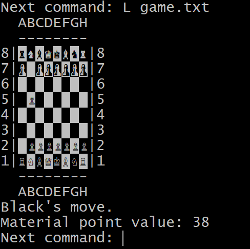

<div class='admonition caution'>
<div class='title'>Important Details</div>
<div class='content'>
<ul>
<li>You are expected to work in a team of three.</li>
<li>Deadlines (Baltimore time):</li>
<ul>
<li><strong>Team Registration/Request: Saturday November 16th at 11pm.</strong></li>
<li><strong>Development Plan & UML Diagram: Friday November 22nd at 11pm.</strong></li>
<li><strong>Implementation: Friday December 6th at 11pm.</strong></li>
<li><strong>Evalaution Form: Sunday December 8th at 11pm.</strong></li>
</ul>
<li>This assignment is worth 165 points.</li>
<li>No late days may be used!</li>
</ul>
</div>
</div>

## Quick Links

[Rules of Chess](#the-game)

[Implementation Details](#implementation-details)

[Code Submission](#code-submission-team)

[Additional Deliverables](#additional-deliverables)


## Learning Objectives

This project is intended for you to utilize techniques we've learned throughout the course, with a focus on object-oriented design in C++.

## Overview

You will work in your three-person team to implement a version of the board game chess in C++.  This is an exercise both in object-oriented design and in the proper application of the programming techniques we’ve learned throughout the course.  A portion of your grade will be based on the merits of your design, including reducing code duplication. Your code must be well documented and tested, with all memory leaks eliminated.

## Getting started

### Register or request a team

We strongly recommend forming a team of 3 students from within the same section. There is a Piazza post you can use to find teammates. Once you have found partners, or if you are not able to find partners, you must submit a team registration using [this survey](https://forms.gle/iRKwRrKxrtzACLRg8). Read the form carefully to make sure you are completing it properly. If you do not include 3 team members on the form, we will find partners for you. *Only 1 person on a team should submit the registration for all of you.*

### Set up your final project git repository

* If you have registered your team on time, you will be invited to a private repo (`2024-fall-final-<JHED1>-<JHED2>-<JHED3>`) under your repositories on GitHub.

* Otherwise, you should receive a private post from us about your assigned partners on Piazza. You should reply to the post to exchange your contact information with your teammates and let us know all members are connected. We then create and invite you to a team project repo. If you have not received the post, reach out to us as soon as possible.

Once you have access to the group repo, you should clone it to your ugrad Unix account (and optionally local machine) the same way you cloned your personal repo in Ex2 Part 4.

<div class='admonition tip'>
<div class='title'>Good Practices</div>
<div class='content'>
If you have opted to use <a href="/docs/resources/github-ssh">SSH authentication</a>, remember to clone it with the `git@` link. Otherwise, you should use the `https://` one.
</div>
</div>

### Get the starter codes from `cs220-f24-public`

1. Use `cd` to move into the `cs220-f24-public` on your unix account, type `git status` and confirm you have not modified any files or accidentally committed to the public repo. Ask
for help, if you need to undo those accidental changes.

2. Type `git pull` to synchronize your local repo with the remote repo.

3. You should see a new directory, `final`, which contains the starter code and example files.

4. Copy the source files (`.h` and `.cpp`) and text files (`.txt`) in `final` to your final project repo. Assuming both the public repo and your final repo are under your home directory, and you have not changed the directory names, then you can copy the starter codes to your local final repo.

5. Use `cd` to move into your final repo, type `git status`, and confirm you see all the starter files.

6. Do your first commit to add the starter codes to the repo and push them to the remote repo. You can run `git add .`, `git commit -m "Initialized with the starter codes"`, and `git push`.

Your final repo is now ready for development!

<div class='admonition caution'>
<div class='title'>Reminder</div>
<div class='content'>
Only one team member needs to set up the repo when it is the first use. Once it has been set up, the partners can get the starter codes directly by cloning the remote repo or synchronizing their local repositories (`pull`).
</div>
</div>

You will now work in a team. You may encounter conflicts more often when you push your code from local to remote. This happens when your teammates have changed the same files and same segments as you have done. If it happens, you will need to resolve the conflicts, compile, and test your code before committing the conflict-resolved version. Typically you will see something like below in the file that has a conflict:

```
<<<<<<< HEAD
This is how the file in the current remote (github) repo looks

=======
This is how the file in your local repo looks

>>>>>>> <a commit id>
```

To resolve the conflict, you need to decide which version to use or how they should be merged. To minimize the conflicts, you should
- Communicate with your teammates to avoid editing a file at the same time,
- Always sync with the remote before you start working (pull), and
- Commit and push often 


### Development Plan
This project is similar to or even somewhat larger than midterm project and having teammates to help means that you can all benefit from your teammates' expertise, but also need to plan more carefully.  Thus, as part of this project, you are expected to create a **development plan** to keep track of tasks that need to be completed.  We suggest the following process:

* Start by brainstorming the tasks that are required to complete the project successfully.  The sections below detail the functionalities that your project is required to support, and some requirements regarding how you should break these down into individual files.  These functionalities and files are a good starting point -- but, they may need to be broken down into smaller tasks.  Make sure you consider testing as well!  You do **not** want to turn in a project that has not been tested!

* Consider the relative difficulty of tasks.  Some of the functionalities are expected to be considerably easier than others.  How much easier?  That's up for you and your partner(s) to discuss.  Header files are likely to be relatively small tasks, particularly in comparison to the actual implementation.  We are not expecting you to come up with exact estimates here.  Instead, try to identify (approximate) relative difficulties.  

* Estimate _task dependencies_.  What tasks depend on each other?  For each task that you complete, what new tasks can now be completed?  Do you think that any of the other functions you're supposed to implement depend on each other?  If so, how?

* Assign owners and deadlines.  Based on the tasks, difficulties, and dependencies you estimated above, figure out a reasonable plan for who is going to get what done, and when.  Try to make sure that each member on your team has approximately the same amount of work.  Prioritize tasks that many other tasks depend on, so that you don't end up with a bottleneck later on where many tasks are all blocked waiting on one to be completed.  Having deadlines helps you and your partner(s) hold yourselves accountable, and makes sure that you don't end up with too much work pushed towards the latter end of the project.

After completing these steps, record your development plan in the README file of your team's repository.  For each task, list the task name, difficulty, dependencies, owner, due date, and status.  We suggest that you use a [Markdown Table](https://www.tablesgenerator.com/markdown_tables) to keep all of the tasks nicely formatted, just like what you did for the midterm project.  You should keep your development plan consistently updated -- after all, a plan that doesn't match reality doesn't do much to help everyone see where the project stands.

We expect your development plan to contain _at least 15_ tasks, but you are welcome to add more if it makes sense to you.  Please keep tasks ordered by due date, so it's easier for everyone (and particularly you!) to make sure you're staying on schedule.

The content of the development plan is largely in your hands. You should rigorously test your code, but you are not required to hand in specific tests with your submission. Beyond that, it is largely up to you how to structure your project, and in what order to implement features, but you **must take a modular approach**, and make proper use of object-oriented programming!

We recommend that you break your code into several files, and have as little code as possible in your `main` function (and more broadly, in the `.cpp` file that houses it). 

<div class='admonition tip'>
<div class='title'>Good Practices</div>
<div class='content'>
<p>Aim to write small, clean helper functions for better readability and easier testing, as well as greater reusability. Then, make a plan for what order you will implement the modules in. You will also want to test your modules; it's a good idea to use test-driven design, which means that you will design tests for your functions before you actually start trying to write the functions themselves.</p>
</div>
</div>

For each class and the methods defined in it, it's important to think about precisely what they should do, and also how you can test them to be sure they are doing what you want. It would be a good idea to write unit tests with `assert` statements, but we do not require you to do so.  But, in either case, you ultimately need to run the program you write numerous times and test its different functionalities.

### UML Diagram (Team)

Create a simplified UML diagram that represents all the classes and their relationships in this final project. Use the format of the examples in the OO Design & UML Diagrams lesson. Here, each class name should appear in a rectangle. Use arrows from each derived class to its base class to indicate an inheritance relationship. Use diamonds at each containing class with a line to the class it contains. You are not expected to include class members in the diagram, but you could if that aids your understanding. 

You should create the UML diagram *before writing any code* to help yourselves visualize and keep track of this large class hierarchy. You can create your diagram with any common document program such as Microsoft Word, PowerPoint or Google Docs. (Handwritten diagrams are not acceptable.) You must save and submit your UML diagram in pdf form, named `chessUML.pdf`.

## The Game

### Chess Rules

A description of the official rules of chess can be found [here](https://www.chess.com/learn-how-to-play-chess), but we give the main points of the game below, with some adjustments specific to this project.

### Game Setup

* The board is a single 2D 8 x 8 grid.
* There are two players, a white piece player and a black piece player.  
* The board is always oriented so that the starting position of the white pieces is at the bottom, and the starting position of the black pieces is at the top.
* There are six types of pieces in chess: king (denoted here with K or k), queen (Q/q), bishop (B/b), knight (N/n), rook (R/r) and pawn (P/p). Upper-case letters indicate the white pieces, while lower-case letters denote the black pieces.
* Each player begins the game with 1 king, 1 queen, 2 bishops, 2 knights, 2 rooks, and 8 pawns. 
* At the start of the game, pieces are placed [as shown here](https://www.chess.com/article/view/how-to-set-up-a-chessboard).
* The person playing white starts the game by making the first move, then players alternate moves until the game ends.

### General Movement of Pieces

When it is his or her turn, a player may move exactly ONE of his or her pieces according to the following movement rules, provided that

1. the piece does not land on a square already occupied by another piece belonging to that _same_ player, and
2. the move does not cause the player to enter a _checked_ position (defined below).


Movement rules:
* A king may move in any direction, including diagonally, but may only move one square.
* A queen may move any number of spaces in one direction, including diagonally. A queen may not move through other pieces.
* A bishop may move diagonally only but may move any number of spaces. A bishop may not move through other pieces.
* A knight may move in an [L-shape](https://en.wikipedia.org/wiki/Knight_(chess)#Movement), of length either two-by-one or one-by-two. The knight is the only piece that is not stopped by other pieces in its way (i.e. it _can_ move through other pieces to get to an open square).
* A rook may move any number of squares, but only along a horizontal or vertical line on the board. A rook may not move through other pieces.
* A pawn can move only forward towards the opponent’s side of the board, but with restrictions. On its first move of the game, a pawn may move forward either one or two squares; on subsequent moves, a pawn may only move forward one square. A pawn may not move through other pieces. Furthermore, the pawn may not use a forward move to land in a square that is occupied by any player’s piece.  In a separate type of action, a pawn may make a special move to “capture” an opponent piece (discussed below). (Finally, in official chess, the pawn sometimes has another move option called _en passant_. This is a fairly advanced rule, and we won't implement it in our game.)

The rules are also summarized in the following image. Note that the pawn has distinct ways of moving (x's) and capturing (circles):


From: [https://alchetron.com/Tron/CHESS-The-Games-for-the-Brain-576-UW#-](https://alchetron.com/Tron/CHESS-The-Games-for-the-Brain-576-UW#-)

### Capture

If any piece other than a pawn moves according to the movement rules above, and ends up in a square occupied by a piece owned by the opposing player, then the opponent’s piece is “captured” and removed from the board for the remainder of the game.

Pawns have different shapes for normal movement versus for capturing. Pawn _movement_ is always forward (one or two squares, depending on the original position), whereas _pawn capturing_ is always diagonal. See [here](https://en.wikipedia.org/wiki/Pawn_(chess)#Capturing).

### Special Movement of Pieces

During gameplay, if a pawn ever reaches the last row of the board (the opposite side from its starting position), it immediately becomes a queen.  This is called piece promotion. [See here](https://en.wikipedia.org/wiki/Pawn_(chess)#Promotion). (Actually, in standard chess, the player who owns the pawn gets to select what type of piece he or she wishes to upgrade, but nearly everyone selects queen, so we'll just make that the requirement.)

In standard chess, players are also permitted two special moves named [castling](https://en.wikipedia.org/wiki/Castling) and [en passant](https://en.wikipedia.org/wiki/Pawn_(chess)#Capturing). In this project, these moves are explicitly disallowed. (They are quite complicated to implement.)

### Checked Positions, Checkmate and End-of-Game Situations

* If a king is ever threatened by any piece of the opposing player in such a way that a single move by the opponent could result in the king’s immediate capture, this is considered a _checked position_. Getting out of a checked position is the highest priority for the player who is checked — while a player is in a checked position, his or her only option is to make a move that gets the king out of danger; no other move is permitted. (This can be done either by moving the king out of check or blocking the check with another piece or capturing the checking piece of the opponent.)
* No player is permitted to make a move that places himself or herself in a checked position. This includes a player moving his or her king into danger, but also includes moving out of the way a piece which had been sheltering the king, leaving the king unprotected. This rule means that a player can only be checked by a move made by the opposing player.
* If a player is checked, and the checked player has no way of removing the check condition, this is called a _checkmate_, and the checking player is declared the winner of the game. The overall goal of a player is thus to checkmate the opposing player.
* If any player is not in a checked position but has no legal moves available, the game is declared a stalemate. The game ends without a winner.

<div class='admonition tip'>
<div class='title'>Hint</div>
<div class='content'>
Note: To determine if it is a check or checkmate, <b>a brute-force approach to check all possible moves is enough. You don't need to implement any sophisticated algorithm.</b>
</div>
</div>

### Hints for Implementing Game Rules

The `make_move` member function in the `Game` class is required to determine whether or not the move being proposed is legal. This includes checking whether the shape of the move is legal, and separately (for applicable piece types) whether the path along the move is clear. (Note that `legal_move_shape` should *only* check the ending position, not the full path. In particular, the `Mystery` piece's `legal_move_shape` will not check if the path is clear.)

One important aspect of determining whether a move is legal is checking whether the move would place the player's king in check.  One fairly straightforward way to do this is to create a copy of the current game state (i.e., a replica `Game` object), carry out the proposed move, and then determine whether the player's king is in check in the replica. This approach avoids the need to implement special-purpose logic to determine whether the player's king *would be* in check.

### Hints for Iterating the Board

To iterate the board, you can iterate each `Position` (`std::pair<char, char>`) where the pair has its first value in {'A','B','C','D','E','F','G','H'} and second in {'1','2','3','4','5','6','7','8'}. It will be helpful and better to have an iterator class (`Board::iterator`) that encapsulates the board iteration logic. Instead of copying the iteration logic all over the place, you should use the standard iterator for loop to traverse each square of the board e.g.

```c++
for (Board::iterator it = board.begin(); it != board.end(); ++it) {
  // *it should return you the position of the current square on the baord
}
```

## User Interface

To launch the program, the user will type `./chess` at the command line, optionally followed by a filename command-line argument. If a filename is supplied on the command-line, then upon completion of the game (checkmate or stalemate) or if the user elects to quit playing a game that hasn't ended yet, the current status of the game should always be output to the specified file. If no filename is specified, no output is written, and no output file is created. This is independent of the user selecting the 'S'ave operation below. 

Once the program is running, a chess game using the default chess board is created, and the user is presented with a list of possible actions as follows:

* ? — display the list of actions
* Q — quit the game
* L &lt;filename&gt; — load a game from the specified file
* S &lt;filename&gt; — save the current game to the specified file
* M &lt;move&gt; — try to make the specified move, where &lt;move&gt; is a four-character string giving the column ('A'-'H') (must be an upper case to be valid!) and row ('1'-'8') of the start position, followed by the column and row of the end position.

Note that your program should work for both upper-case and lower-case action user input. 

Prior to the user selecting an action, the current state of the board is presented to the user on standard output. The user can repeatedly enter one of the above action specifiers until the program ends, which happens when the game reaches checkmate or stalemate, or the user elects to quit.

Sample Runs are linked here with interactive user input shown (in bold) interleaved with program output.
* [Sample run #1](chess_sample1.html)
* [Sample run #2](chess_sample2.html)
* [Sample run #3](chess_sample3.html)

**Note** Your board does not need to look exactly like ours - see Customizing the Board Style below. We just illustrate one possibility for how you might format things so that the game state and prompts are clear.

The format of the game board may look wonky in the sample files above due to the size of the chess pieces relative to empty game spaces, so the following image better illustrates a properly-formatted sample board:




### Exception Handling

In `main.cpp`, you will note a `TODO` comment where `operator>>` is used to load the game from a file. The `operator>>` should throw an `Exception` if it fails to load the game for any file I/O error, or any formatting issue. You should add exception handling code using `try` and `catch` to catch this exception, print the error message (using `what()`) to `std::cerr`, and terminate the program with return code `-1`.

The `make_move` member function of the `Game` class is responsible for carrying out a move specified by the user.

If the requested move is illegal (according to the game rules described above), `make_move` should throw an `Exception`.  (`Exception` is an exception class defined in `Exceptions.h`.)  When an exception is thrown, use code of the following form:

```cpp
throw Exception(message);
```

where `message` is one of the following messages:

```
start position is not on board
end position is not on board
no piece at start position
piece color and turn do not match
illegal move shape
cannot capture own piece
illegal capture shape
path is not clear
move exposes check
```

In `main.cpp`, you will note a `TODO` comment where the `make_move` member function is called.  You should add exception handling code using `try` and `catch` so that if `make_move` throws an `Exception`, an error message of the form

```
Could not make move: message
```

is printed to `std::cerr`, where `message` is one of the error messages listed above. **Important**: make sure that the error message is printed *exactly* as specified above.

An attempt to make an illegal move should not change the game state in any way.  So, if an illegal move is entered, the exception thrown by `make_move` is caught and handled (by printing the error message), and the user will have an opportunity to continue the game by entering a legal move.

In addition, the `add_piece` member function of the `Board` class should also throw an `Exception` when it fails to add a piece to the board. These situations include:

- An invalid piece designator is provided. An exception with an error message "invalid designator" should be thrown.
- The specified position is not on the board. An exception with an error message "invalid position" should be thrown.
- The specified position is already occupied on the board. An exception with an error message "position is occupied" should be thrown.

### File Format for Loading/Saving Games

The format of a file specifying a game contains nine lines. The first eight lines in the file indicate the contents of row 8 down through row 1. In each of these first 8 rows, there are 8 characters present before a newline, one character per column from 'A' through 'H'.  The special symbol '-' is used to denote an empty location on the board, while the standard single-character piece designators represent each piece present on the board. Finally, on the ninth line, there is a single character which is one of 'w' or 'b', where 'w' denotes the player with white pieces and 'b' denotes the player with black pieces. For files representing in-progress games, this character indicates which player's turn is next, but in the case of a game that has reached checkmate or stalemate, the letter on the ninth line will indicate the player whose turn it was when the game ended.

In your code, the program may fail to load the game. If it happens, it will be handled by exceptions.  Refer to the [Exception Handling](#exception-handling) section for details.  After successfully loading the game, the `main` function will assert if it is a valid game by calling `is_valid_game()`.

In the public course repository's `final` directory, we have provided several example files (`stalemate.txt`, `checkmate.txt`, `check.txt`) illustrating different important game situations. Your program should be able to load in these files and report the conditions they represent.

Additionally, we have supplied you with several files (`mate_in_two.txt` and `promotion_to_mate.txt`) indicating series of moves that a user might enter interactively while running the program. (The additional file `pre_promotion.txt` is utilized if commands in `promotion_to_mate.txt` are executed.) You are encouraged to use `cat` and the Unix pipe operator (`|`) to run these commands from the command line and then to check your program's output. You should also, of course, create and utilize other tests as you are developing your code.


## Implementation Details

In the public course repository's `final` directory, we have supplied you with the following starter files, at the top of which you must add comments giving the names and JHED IDs of each of your team members, and which you may further modify as needed except where indicated:

* `Piece.h` (do not modify this file) — contains the definition of an abstract class named `Piece` which represents a chess piece. This class is fully implemented in `Piece.h` (so there is no need for a file named `Piece.cpp`). It contains two pure virtual functions which will need to be implemented in each subclass of `Piece`.
* `King.h`, `Queen.h`, `Rook.h`, `Knight.h`, `Bishop.h`, `Pawn.h` — contain, respectively, class definitions of subclasses of `Piece` representing various specific chess pieces. You may modify these files as needed, including by changing the stub (incomplete) function definition for `legal_move_shape` in each header into a declaration, overriding `legal_capture_shape` in classes where appropriate, or adding additional member functions, so you can fully implement each function properly in its associated `.cpp` file.  **Important**: You will need to create a `.cpp` file for each subclass of `Piece`.  The provided `Makefile` will not work fully until all of the `.cpp` files have been created.
* `Board.h` — contains the class definition of a class named `Board` which represents a chess board. Some of the implementations of these member functions are left to you to flesh out in `Board.cpp`.
* `Board.cpp` — contains the implementation of `Board`'s `<<` operator (do not modify this implementation), which will be used in the autograder. It also contains stubs for many member functions declared in `Board.h`, which you will need to replace with fully functioning code. Note that the `display` member function is a place where you may be creative, including making use of `Terminal.h` as described below.
* `Game.h` — contains the class definition of a class named `Game` representing a chess game, as well as two declarations for overloaded operators related to `Game`.
* `Game.cpp` — contains the implementations of a default constructor (do not modify this implementation) and `Game`'s `<<` operator (do not modify this implementation). Also contains stubs for many member functions declared in `Game.h`, which you will need to replace with fully functioning code.
* `main.cpp` — contains the basic game loop. You will need to modify the `main` function so that exception handling is used to detect and recover from attempts to make an illegal move, and terminate the program upon game loading failure.  See the [Exception Handling](#exception-handling) section.
* `Mystery.h` (there is no need to hand in this file; we'll be modifying it when we grade) — contains dummy code for a subclass of Piece which will be replaced after submission by the graders. You won't use this file in a standard chess game, but we will as we grade your code, to ensure you're taking full advantage of virtual functions and dynamic binding in your design. See the Mystery Piece section below for details.
* `CreatePiece.h` (do not modify this file), `CreatePiece.cpp` (do not modify this file) — contain code that allows us to generate pieces from their ASCII representation. We include a Mystery piece as an option here.
* `Terminal.h` (do not modify this file) — contains helper functions which allow you to change the background and foreground colors of output to standard out. You may optionally use these functions as you write your custom `Board::display` member function.
* `Makefile` — this is a complete `Makefile` for you to use.  You should not need to modify it.

Note that all classes are in the `Chess` namespace.

You must additionally finish implementing the following files provided in the starter code:

* `King.cpp`, `Queen.cpp`, `Rook.cpp`, `Knight.cpp`, `Bishop.cpp`, `Pawn.cpp` —  contain implementations of constructors and various functions in the respective header files, which are not given in the class definition itself. As always, only short (i.e. one-line) function definitions should appear inside .h files; the rest should be given in `.cpp` files.

### Piece Creation

We include completed code in `CreatePiece.h` and `CreatePiece.cpp` which will allow you to create pieces of various types to put them on the board at a specified location. While you will not need to modify this code, it may be helpful to review it to try to get a sense of how it functions. We deliberately made the constructors of the `Piece` class protected and the different `Piece` subclasses private, so you cannot accidentally construct a raw `Piece` object — all construction must happen through the `create_piece` function. (See, for example, the implementation of `Board::add_piece`.) In other words, `Piece` is an <em>abstract base class</em>.

In order to load a saved game from a file, you'll want to read in the information from the file and make repeated appropriate calls to `Board::add_piece`, which will call `create_piece` from code in `CreatePiece.h/.cpp`. Be sure that your game loading mechanism is equipped to handle mystery pieces, as discussed in the next section.

### Mystery Piece

To illustrate the power of dynamic dispatch in interfacing with existing code, we will compile your code with our additional code to add a "mystery piece" to the chess game. This piece does not exist in the current design when a game is created with a default constructor, but when a game is loaded from a file, any `M` or `m` designator present indicates that a mystery piece is to be placed on the board. In the starter code, there is a stub of a `Mystery` class given to you. At grading time, however, this code will be replaced with a more interesting version of the `Mystery` class. This piece will move in some way which is as yet unspecified, but your implementation should be able to handle its workings, no matter its movement pattern. You'll need to use the common `Piece` and `Board` member functions to make sure that your code can handle this type of piece.

You may assume that the mystery piece with which we'll grade your code will include definitions of the member functions supplied to you in the starter code.  The definitions will be different than what you have been given, but there will be definitions. Additionally, you may assume that if the mystery piece's legal move shape is along a straight line (either horizontal, vertical, or diagonal), it will not be permitted to move through pieces. Furthermore, if the mystery piece's legal move shape is NOT along a straight line, it will always be permitted to move through pieces. Create your own `Mystery` piece class for testing purposes. For example, a mystery piece could be one that could move in a 2x3 or 3x2 L-shape (mimicking what Knight can do, but with moves that can cover more ground).

You should assume that the full definition of the `Mystery` piece class will be specified in some file named `Mystery.h`. When we grade, we'll supply a new version of `Mystery.h` to replace the `Mystery.h` file we released to you, and your `Makefile` should already be set up to compile it. In your `Makefile`, do not expect any file called `Mystery.cpp`. Furthermore, you need not submit the released `Mystery.h` to Gradescope.


### Customizing the Board Style Displayed in Interactive Output

The provided file `Terminal.h` contains helper functions which allow you to change the background and foreground colors of output to standard out, e.g. in your `Board::display` member function. You can use any of the values of the `Color` enum found in `Terminal.h` for both foreground and background colors. Foreground colors also have the option of being ‘`bright`’, which means you effectively have even more foreground colors at your disposal. Use `Terminal::color_fg` to set the foreground color and its bright flag. Use `Terminal::color_bg` to set the background colour. `Terminal::color_all` allows setting both colors at once, and `Terminal::set_defaults` resets you to the normal text colors once you’re done printing your board.

Here's an example of how you might call the functions using the `Color` enum defined in `Terminal.h`. Note that since the functions in `Terminal.h` are static, we call them using the `Terminal::` prefix (rather than on an object). And similarly, since `RED` is constant defined in `Terminal.h`, we have to prefix it as well. After setting the colors, writing to the display normally using `std::cout` will make use of the current color setting.


```cpp
Terminal::color_fg(true, Terminal::RED);
cout << "some stuff to print" << endl;
Terminal::set_default();
```

You may use any ASCII characters to display your board on standard out, and you should be creative in writing `Board::display`. Keep usability in mind when you design your board,  making sure that you include row and column headings so that the users know how to refer to each position when making a move. Lastly, remember that you may not modify the definitions of the `<<` operator in `Board` or `Game`. The purpose of this function is different from that of `Board::display`, even though they may have quite a bit of code in common. You cannot write `Board::display` by simply calling `operator<<`.

### General Requirements

* You may use `std::cin`, `std::cout`, `std::ifstream`, `std::ofstream`, the insertion operator (`<<`) and the extraction operator (`>>`) for all input and output.  Don't use `printf`, `scanf` or other C I/O functions.
* Your program should only use `new` and `delete` for dynamic memory allocation and deallocation. You may not make direct use of C functions like `malloc`, `calloc`, or `free`.
* You are expected to factor your code into functions, each function performing a distinct task.  Don't do everything in one giant function.
* All variables must be declared inside functions. No variables may be global or `extern`.
* You should only provide implementations of functions in a `.h` file if the implementation is <em>very</em> simple. Otherwise, you can change the definition to a prototype in the `.h` file, and give its definition in an appropriately-named `.cpp` file.
* You may not use the `auto` keyword.
* You must use header guards in all header (`.h`) files.
* You may not use `using` in header (`.h`) files.
* In C++ source (`.cpp`) files, you may import individual symbols using statements like "`using std::string`".  But you may <em>not</em> use "`using namespace <id>`", either in headers or in source files.
* You are expected to make use of <strong>gdb</strong> to debug and also to run <strong>valgrind</strong> to make sure there is no memory leakage or invalid memory usage.
* Each source file you submit should contain several comment lines at the top giving the names and JHEDs of each member of your project team.
* You are encouraged to begin submitting your work well before the deadline, keeping in mind that there are no late days available for use with this group assignment.

## Code Submission (Team)

Create a zip file named `project.zip` containing your source files as well as `chessUML.pdf`, `README`, `Makefile` and `gitlog.txt`. (While we do absolutely expect you to write code that tests your implementation, you are not expected to submit your tests to us for grading.)

Copy `project.zip` to your local machine and submit it as Final Project (Team) on Gradescope. This will be a group submission, where *you must indicate each team member's name on Gradescope when you (first) submit*. Please make sure that the same team member submits subsequent versions as well.

As always, when you submit, Gradescope conducts some automatic tests. These do basic checks, e.g. to check that you submitted the right files. If you see error messages (in red), address them and resubmit. You may re-submit any number of times prior to the deadline; only your latest submission will be graded.

Two notes regarding automatic checks for programming assignments:

* Passing an automatic check is not itself worth points.  (There might be a nominal, low point value like 0.01 associated with a check, but that won’t count in the end.) The checks exist to help you and the graders find obvious errors.
* The automatic checks cover some of the requirements set out in the assignment, but not all. It is up to you to test your own work and ensure your programs satisfy _all stated requirements_.  Passing all automatic checks does not mean you earned all the points.


## Additional Deliverables

### Development Plan (Team)

Submit your initial development plan in a plain text file called README (no .txt or other extension) to Gradescope before the deadline. As noted above, you can use Markdown formatting to make this look nice. Remember to include all team member full names and JHED IDs in your submission. Keep this file updated as your development progresses and submit again with your final code submission. 

### UML Diagram (Team)

Submit your initial UML diagram in a pdf file called `chessUML.pdf` to Gradescope before the deadline. Remember to include all team member full names and JHED IDs in your submission. Keep this file updated as your development progresses and submit again with your final code submission.

### Git Log (Team)

Each person should be committing their work; it shouldn't be the case that the same team member is always performing the commits for your team. Your submission must include a copy of the output of `git log` showing at least *six* commits to the repository by each team member. (You're likely to have significantly more than that!) Save the `git log` output into a file called `gitlog.txt` (e.g. by doing `git log > gitlog.txt`).

### Final Project Partner Evaluation Form (Individual)

In addition to submitting your project files (see below), each team member must complete the [Final Project Partner Evaluation Form](https://forms.gle/mGRkz5kJ7N7vaKLX7) for each of their team members, including themselves, before 11pm Sunday 12/8. This is to say, if you are in a team of three, you will be submitting the form three times: once for each partner and once for your self evaluatoin.

This is an important part of the project and there will be a **5-point penalty** for failing to submit each form. The contents of the form you submit will not affect your partners' grades.

Note that the deadline for this individual submission is 48 hours after the code submission deadline (i.e. Sunday 12/8 at 11pm).

## Grading Breakdown (165 points total)

* (13 points) Development Plan
* (7 points) UML Diagram
* (15 points) Project Submission & Style (including updated README, UML diagram and gitlog)
* (130 points) Project Code Functionality (including memory usage)
* (5 point deduction per missing submission) Partner Evaluations
